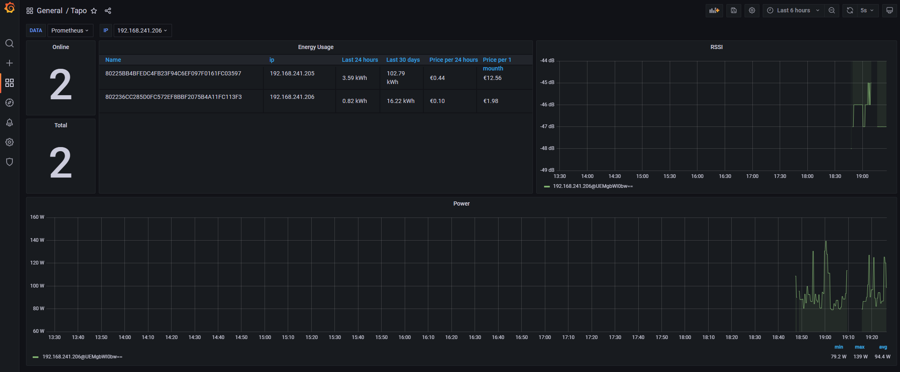

# TAPO smartplug prometheus monitoring
Tapo smart pulug advanced monitoring for prometheus &amp; grafana. The aim of this project is to provide an extended and long-term
monitoring over tapo sockets. This overview should be available from all devices and contain data over months to years for a more detailed analysis of electricity consumption, its price, and the like. Also have the option to add notifications for non-standard behavior, for example high or low electricity consumption

### How to use it - source code?

This is a spring boot application that has a RESTful API and Prometheus metrics for better monitoring of smart sockets Smart Plug metrics for TP-Link Tapo P110.

To run from the source code, just run the 

```online.labmaster.taposmartplug.TapoSmartplugApplication``` 

class with the following virtual machine parameters

```-Dtapo.plug.username=username -Dtapo.plug.password=password -Dtapo.plug.IPs=plug ip1,plug ip2```

 - tapo.plug.username: **name for tplink account**
 - tapo.plug.password: **password to the tplink account**
 - tapo.plug.IPs: **ip addresses of sockets**

WARNING! the application must run on the same network as the sockets


### How to use it - docker?

Easy to run with a command

```docker run -p 8080:8080 -e JAVA_OPTS="-Dtapo.plug.username=username -Dtapo.plug.password=password -Dtapo.plug.IPs=plug ip1,plug ip2" mirorucka/tapo-smartplug:1.0.1```

The parameters are described above

### How to use it - docker compose?

All services needed to start tapo smart plug are compiled in docker compose. It needs to be installed for full launch

 - prometheus
 - grafana
 - tapo-smart-plug application

The definition is in the ```./docker-compose``` folder

Example:

```yaml
version: '3.9'

services:

  grafana:
    image: grafana/grafana
    container_name: grafana-tapo
    ports:
      - 3000:3000
    networks:
      - tapo

  prometheus:
    image: prom/prometheus
    container_name: prometheus-tapo
    volumes:
      - ./prometheus.yml:/etc/prometheus/prometheus.yml
    ports:
      - 9090:9090
    networks:
      - tapo

  tapo-smart-plug:
    image: mirorucka/tapo-smartplug:1.0.1
    container_name: tapo-smart-plug
    environment:
      - JAVA_OPTS=-Dtapo.plug.username=${tapo_username} -Dtapo.plug.password=${tapo_password} -Dtapo.plug.IPs=${tapo_IPs}
      - BPL_JVM_THREAD_COUNT=70
    ports:
      - 8080:8080
    networks:
      - tapo

networks:
  tapo:
    driver: bridge
```
Settings like

 - tapo_username
 - tapo_password
 - tapo_IPs

need to be exported as system variables

Then just run the ```docker-compose up``` command

### Prometheus metrics

For prometheus, it is necessary to define the target in the ```prometheus.yml``` settings

Example:

```yaml
# scrape tapo-smart-plug devices
scrape_configs:
  - job_name: 'tapo scrape'
    metrics_path: '/actuator/prometheus'
    scrape_interval: 15s
    static_configs:
      - targets: ['tapo-smart-plug:8080']
```

metrics are available at host:8080/actuator/prometheus

all metrics begin with the prefix tapo_

current list

| name of metric                |
|-------------------------------|
| tapo_energyUsage_currentPower |
| tapo_energyUsage_todayEnergy  |
| tapo_energyUsage_monthEnergy  |
| tapo_energyUsage_todayRuntime |
| tapo_energyUsage_monthRuntime |
| tapo_deviceInfo_on_time       |
| tapo_deviceInfo_rssi          |
| tapo_deviceInfo_device_on     |

## Grafana

Two things need to be defined for Grafana:

 - datasource prometheus
 - dashboard for tapo-smart-plug

The dashboard is located at [Super mega dashboard 17216](https://grafana.com/grafana/dashboards/17216-tapo/)



## TODO
- swagger API describe
- API extension with write operation
